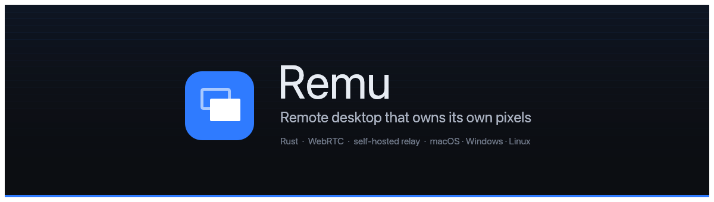
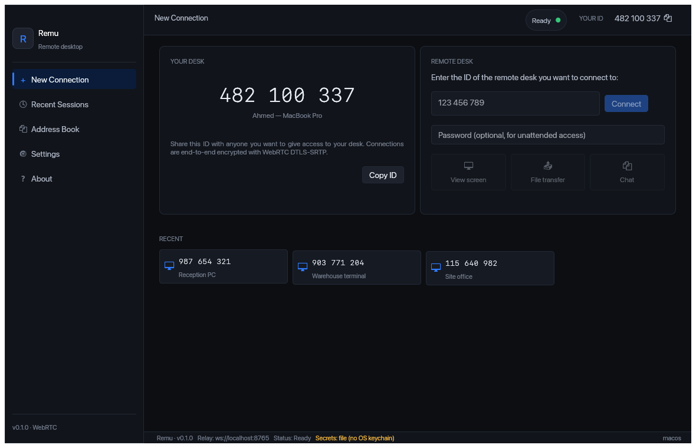
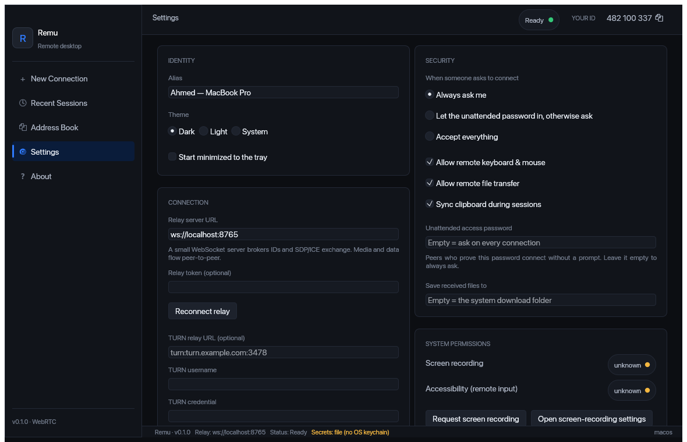
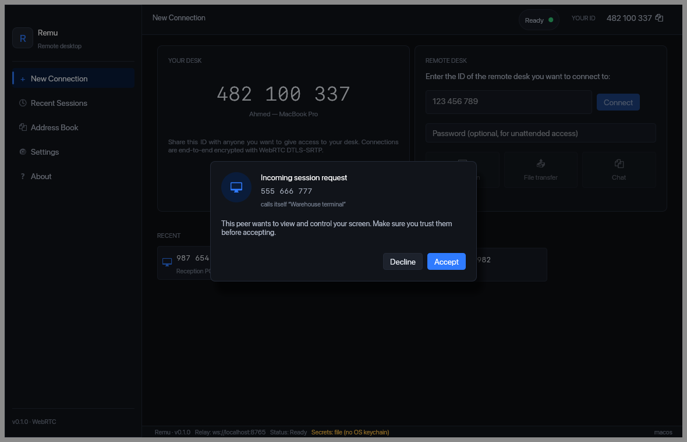
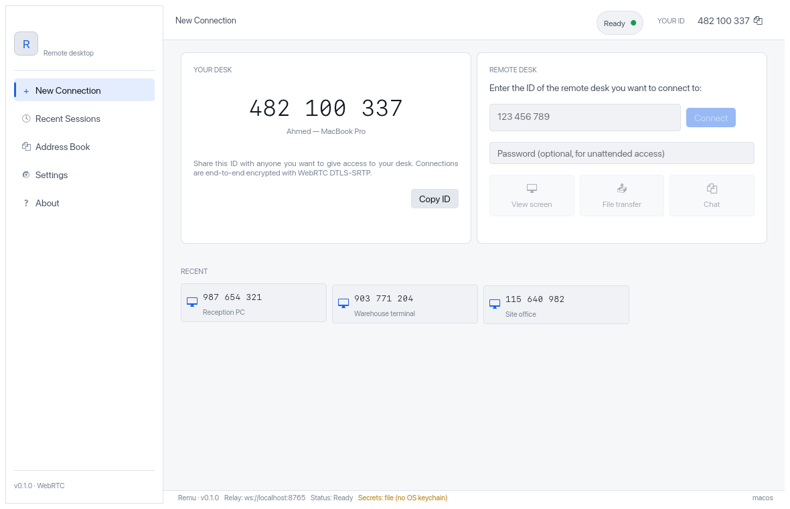

<div align="center">



Remu gives your machine a nine-digit number. Someone types it, you accept, and they are looking at
your screen and driving your mouse — peer to peer, end-to-end encrypted, through a relay **you**
run.

**No account. No service in the middle. No Electron.**

[](https://github.com/ahmedawachi/remu/actions/workflows/ci.yml)
[](#tests)
[](#platform-notes)
[](#requirements)
[](#license)
[](#status)

</div>

---

<div align="center">



</div>

---

```bash
remu            # your desk, and the box you type someone else's ID into
remu-relay      # the server that introduces two desks to each other
```

Remu is an open-source **remote desktop** for **macOS, Windows and Linux** — the AnyDesk shape,
rebuilt in Rust so that the path from a captured pixel to a decoded one belongs to the application
instead of to a browser engine.

- **Nine-digit desk IDs** — read one out over the phone, no account, no directory
- **Peer to peer** over WebRTC, with **DTLS-SRTP** on every frame, keystroke and byte
- **A relay you host** — a single static binary that sees SDP and ICE and nothing else
- **Unattended access** that is replay-resistant, not a hash replayed on every connection
- **Streaming file transfer** on its own data channel, so a big file never freezes the cursor
- **Native input injection**, physical keycodes, so a Linux desk can drive a Windows one
- **One binary, no runtime** — no Node, no Chromium, no 200 MB bundle

## Contents

- [Status](#status)
- [Why](#why)
- [Requirements](#requirements)
- [Install](#install)
- [The app](#the-app)
- [The relay](#the-relay)
- [Security model](#security-model)
- [How it's built](#how-its-built)
- [Tests](#tests)
- [Platform notes](#platform-notes)
- [Known limits](#known-limits)
- [Troubleshooting](#troubleshooting)
- [License](#license)

## Status

**Alpha.** A session connects, and the whole path is exercised by an automated
end-to-end test: two engines, a real relay, real signalling, real WebRTC, real screen capture and
real H.264, asserting that a decoded frame comes out the far end.

```text
$ cargo test -p remu-desk --test end_to_end -- --ignored
host=284843641 controller=581297653
decoded a 3024x1964 frame (23756544 bytes)
test two_engines_complete_a_session_and_a_frame_arrives ... ok
```

| | Component | State |
|---|---|---|
| ✅ | **Relay server** | IDs, SDP/ICE forwarding, rate limits, token auth, `/healthz`. 19 end-to-end tests over real WebSockets. |
| ✅ | **Protocol** | Signalling, control and bulk framing, replay-resistant unattended auth. |
| ✅ | **Screen capture** | ScreenCaptureKit / WGC / PipeWire. |
| ✅ | **H.264 codec** | Encode, decode, BT.601 conversion. |
| ✅ | **Input injection** | Exhaustive keycode map, held-key tracking, permission checks. |
| ✅ | **WebRTC transport** | Peer session, two data channels, streaming file transfer. |
| ✅ | **Desk app** | Every screen; settings and the address book persist, secrets in the OS keychain. |
| ✅ | **Runtime** | Capture → encode → send and receive → decode → present, wired both ways. |
| 🚧 | **File transfer UI** | The engine and its tests are done; the picker is not connected to them yet. |
| 🚧 | **Clipboard sync, session recording, multi-monitor switching** | Protocol support exists; the UI does not drive it yet. |

What this alpha label means in practice: the happy path works and is tested, but it has been run on
one developer's machines, not across the messy variety of real networks. Expect to need a TURN
server sooner than you would with a mature product, and please open issues.

## Why

A remote-desktop client built on a web runtime hands capture, video encoding and congestion control
to the browser engine, and cannot reach any of them. You get the encoder Chromium picked, at the
bitrate Chromium chose, fed by a capture path you cannot profile. That is why those apps burn CPU
and why remote text looks soft.

Remu exists to own that path end to end:

```
capture → colour convert → encode → send → receive → decode → present
```

One process, one language, no serialization boundary anywhere in it. Every other decision in the
project — the crate split, egui instead of a webview, two data channels instead of one — follows
from keeping that sequence intact. [docs/ARCHITECTURE.md](docs/ARCHITECTURE.md) has the reasoning.

## Requirements

- [Rust](https://rustup.rs) **1.85+** (`rustup` installs everything else)
- A GPU or software adapter for `wgpu` — anything from the last decade
- **Linux only:** PipeWire and D-Bus headers, `clang` for the bindings generated from them, and the
  X11 and xkbcommon headers

```bash
# Debian / Ubuntu
sudo apt install pkg-config clang libclang-dev libpipewire-0.3-dev libspa-0.2-dev libdbus-1-dev \
  libxkbcommon-dev libxcb1-dev libxrandr-dev libxi-dev libxtst-dev
```

## Install

Each tagged version publishes ready-to-run downloads for macOS, Windows and Linux on the GitHub
Releases page, with first-run notes for each platform. To build from source instead:

```bash
git clone https://github.com/ahmedawachi/remu
cd remu
cargo build --release
```

Two binaries land in `target/release`:

| Binary | What it is |
|---|---|
| `remu` | The desk app you run on both machines |
| `remu-relay` | The server that introduces them |

## The app

```bash
./target/release/remu
```

<div align="center">

</div>

Point **Settings → Connection** at your relay. Your desk ID appears top-right, click to copy.
Type the other machine's ID into **Remote Desk** and press Connect; a prompt appears on the far
side unless they have set an unattended password and you supplied it.

**Running two copies on one machine** — each needs its own config, or they share an identity:

```bash
REMU_CONFIG_DIR=/tmp/remu-a ./target/release/remu &
REMU_CONFIG_DIR=/tmp/remu-b ./target/release/remu
```

<table>
<tr>
<td width="50%"></td>
<td width="50%"></td>
</tr>
<tr>
<td align="center"><em>Nobody gets in without this, unless you said otherwise</em></td>
<td align="center"><em>Light theme, from the same tokens</em></td>
</tr>
</table>

Set `REMU_LOG=debug` for verbose logging.

## The relay

```bash
./target/release/remu-relay --port 8765
```

```
remu-relay listening   addr=0.0.0.0:8765 token_required=false
  local:   ws://localhost:8765
  health:  http://localhost:8765/healthz
  LAN:     ws://192.168.1.24:8765   <- share this with peers on this network
```

On a LAN that is all you need. **On the public internet, two things are not optional:**

```bash
REMU_RELAY_TOKEN=$(openssl rand -hex 32) ./remu-relay --port 8765
```

A relay reachable from the internet without a token is an open directory of reachable desks — it
will hand an ID to anyone who asks. Give every desk the same token under **Settings → Connection**.

The desk app speaks plain `ws://` to the relay; it is built without TLS support, so a `wss://` URL
does not connect. Signalling is therefore readable on the path — desk IDs, aliases, addresses and
session set-up, never media or input, which are encrypted peer to peer. Until the client grows
TLS, reach a remote relay over a VPN rather than exposing it on the open internet.

<details>
<summary><strong>All relay options</strong></summary>

Every flag has an environment variable, so a systemd unit or container needs no command line.

| Flag | Env | Default | What it does |
|---|---|---|---|
| `--host` | `REMU_RELAY_HOST` | `0.0.0.0` | Bind address |
| `--port` | `REMU_RELAY_PORT` | `8765` | Port |
| `--token` | `REMU_RELAY_TOKEN` | *unset* | Shared secret required to register |
| `--register-rate` | `REMU_RELAY_REGISTER_RATE` | `30` | Registrations per IP per minute; `0` disables |
| `--register-burst` | `REMU_RELAY_REGISTER_BURST` | `10` | Per-IP burst |
| `--message-rate` | `REMU_RELAY_MESSAGE_RATE` | `50` | Messages per IP per second; `0` disables |
| `--message-burst` | `REMU_RELAY_MESSAGE_BURST` | `200` | Per-IP burst |
| `--heartbeat-secs` | `REMU_RELAY_HEARTBEAT_SECS` | `20` | Keepalive ping interval |
| `--pong-timeout-secs` | `REMU_RELAY_PONG_TIMEOUT_SECS` | `60` | Silence before a connection is dropped |
| `--send-queue` | `REMU_RELAY_SEND_QUEUE` | `64` | Messages queued for a slow client before it is dropped |
| `--log-level` | `REMU_RELAY_LOG_LEVEL` | `info` | `RUST_LOG` overrides it |

`GET /healthz` returns uptime and the connected-client count for your monitoring.

</details>

## Security model

The full treatment is [docs/PROTOCOL.md](docs/PROTOCOL.md) §4. The short version:

- **The relay cannot read anything.** It sees desk IDs, who connects to whom, and source IPs.
  Media, files, chat and the password are opaque to it.
- **Unattended access is challenge–response.** The host issues a fresh single-use nonce; the
  controller returns `HMAC-SHA256(password, nonce)`. A proof captured off the wire authenticates
  nothing else.
- **Secrets are not in the config file.** Your unattended password and relay token live in the OS
  keychain. Where no keychain is reachable they fall back to a `0600` file and the status bar says
  so, in amber, rather than downgrading quietly.
- **Peer-supplied filenames are hostile input.** Path components stripped, reserved device names
  defused, nothing written outside the download directory or over an existing file.
- **Remote input is clamped** before it reaches the OS — a peer sending `x: 1e9` or `NaN` moves the
  cursor nowhere interesting.

> The Electron prototype this replaces sent a bare `sha256(password)` on every connection. That
> value never changed, so observing one offer was equivalent to knowing the password. Closing that
> hole is why there is a `connect`/`challenge` round trip before the offer.

Found something? [SECURITY.md](SECURITY.md).

## How it's built

A Cargo workspace of seven crates. The split is not cosmetic: `remu-proto` depends on nothing so
that one definition of the wire format serves every client, and `remu-session` knows nothing about
codecs so that transport and media can be reasoned about separately.

| Crate | What it does |
|---|---|
| `remu-proto` | The wire protocol. No async, no I/O, no platform code — the single source of truth. |
| `remu-relay` | The signalling server. axum + tokio-tungstenite. |
| `remu-capture` | Screen capture: ScreenCaptureKit, Windows.Graphics.Capture, PipeWire. |
| `remu-codec` | H.264 via openh264, plus BT.601 colour conversion. |
| `remu-input` | Input injection via enigo, keymap, OS permission checks. |
| `remu-session` | Relay client, WebRTC peer, file transfer. Transport only. |
| `remu-desk` | The app. egui on wgpu. |

```
              remu-proto  ← everything compiles against this
        ┌─────────┬────────┴──┬──────────┐
    remu-relay  -capture   -input   -session
                     │                  │
                  -codec                │
                     └────── remu-desk ─┘
```

Notable choices, with their costs stated in [docs/ARCHITECTURE.md](docs/ARCHITECTURE.md): **egui,
not a webview** (a decoded frame becomes a GPU texture without crossing a language boundary);
**WebRTC, not bespoke QUIC** (ICE is the difference between working on a corporate network and
working on your desk); **two data channels** (one ordered channel meant a file transfer
head-of-line blocked every mouse move behind it).

## Tests

```bash
./scripts/check.sh              # format, lints, 378 tests, release build
./scripts/check.sh --hardware   # also the 8 tests needing a real display and keyboard
```

378 tests, and the interesting ones are not unit tests of getters:

- **One real session, end to end**, under `--hardware`: two engines, a real relay on an ephemeral
  port, real WebRTC, real capture, real H.264 — asserting a decoded frame arrives, that the stream
  keeps going rather than delivering one keyframe and stalling, and that teardown reaches the peer.
  It is the only test that can catch the layers disagreeing.

- **19 relay integration tests** drive a real server on an ephemeral port with real WebSocket
  clients — full `connect → challenge → offer → answer → ice → bye`, ID reuse, token auth,
  oversized-message disconnects, and a peer learning its partner dropped.
- **9 rendered UI snapshots** through wgpu, committed as PNGs. Two layout bugs — cards stretching
  to the window bottom, the ID chip clipped against the frame — passed every assertion we had and
  were only visible in a picture. `UPDATE_SNAPSHOTS=1` to re-baseline.
- **Codec tests assert exact BT.601 values** against an independent float reference, so the
  fixed-point matrices cannot be merely self-consistent, and check odd dimensions and padded strides.
- **Hostile-peer tests**: path traversal, `..`, Windows device names, oversized frames, truncated
  transfers, wrong digests, duplicate and out-of-order chunks.
- Tests needing a display, a keyboard or a network are `#[ignore]`d and each says how to run it.

## Platform notes

| | Capture | Input | Notes |
|---|---|---|---|
| **macOS** | ScreenCaptureKit | CGEvent | macOS 13.1+. The shared Mac needs Screen Recording **and** Accessibility; Settings requests both and shows live status. |
| **Windows** | Windows.Graphics.Capture | SendInput | Windows 10 2004+. No permission to grant; input cannot reach elevated windows unless Remu is elevated too. |
| **Linux** | PipeWire | XTest | Capture works on Wayland; **input injection needs X11** — the compositor blocks it otherwise. |

Fonts come from the OS at runtime — SF Pro on macOS, Segoe UI on Windows, Inter/Cantarell/DejaVu on
Linux — so the app looks native and no proprietary font ships in the binary.

## Known limits

- **No AnyDesk compatibility.** A different protocol entirely; Remu talks only to Remu.
- **Software H.264 only.** openh264 is the portable baseline. Hardware encoders belong behind the
  existing `VideoEncoder` trait — that is why the trait exists.
- **You supply TURN.** Only STUN is configured. Strict corporate NATs need a TURN server such as
  [coturn](https://github.com/coturn/coturn); set it in Settings.
- **File transfer, clipboard sync, session recording and multi-monitor switching** have protocol
  and engine support but are not driven by the UI yet.
- **No LAN discovery** and **no audio forwarding**.
- **Wayland input injection is blocked** by the compositor. Capture works; control needs X11.

## Troubleshooting

<details>
<summary><strong>macOS: the remote screen is black</strong></summary>

macOS records a Screen Recording grant against the app's code signature, and a build without a
Developer ID signature is a new app to it every time — so an update or a rebuild silently loses the
grant while System Settings still shows it switched on. In System Settings → Privacy & Security →
Screen Recording, remove Remu with the minus button, then click **Request screen recording** in
Remu's Settings and quit and reopen Remu.
</details>

<details>
<summary><strong>macOS: my clicks land in the wrong place</strong></summary>

Almost always a DIP/physical pixel mismatch on a scaled display. Remu positions the cursor using
the capture backend's own physical dimensions for exactly this reason; if you see it anyway, please
open an issue with your display's resolution and scale factor.
</details>

<details>
<summary><strong>"No usable OS keychain"</strong></summary>

The status bar shows this in amber on a headless Linux box with no Secret Service running. Secrets
fall back to a `0600` file beside the config. Install `gnome-keyring` or `kwallet`, or accept the
file — but know that it is a file.
</details>

<details>
<summary><strong>The two desks never connect</strong></summary>

Both must reach the same relay — check `/healthz` from each. If both register but the session never
comes up, you are behind NATs that STUN cannot traverse; configure a TURN server in Settings.
</details>

## License

[MIT](LICENSE-MIT) or [Apache-2.0](LICENSE-APACHE), at your option.
